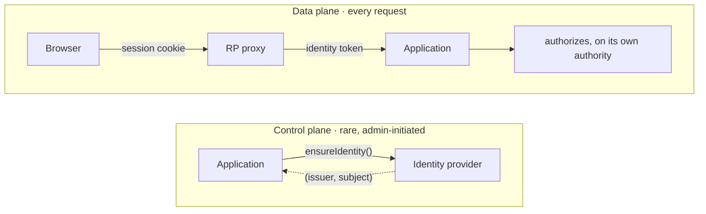
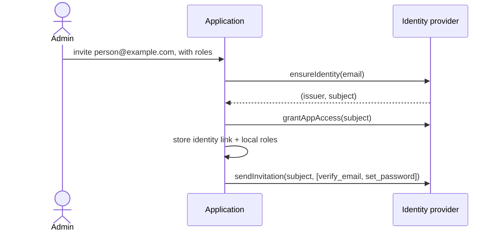
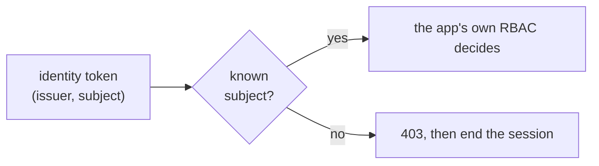
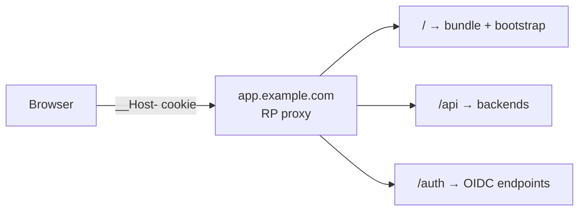
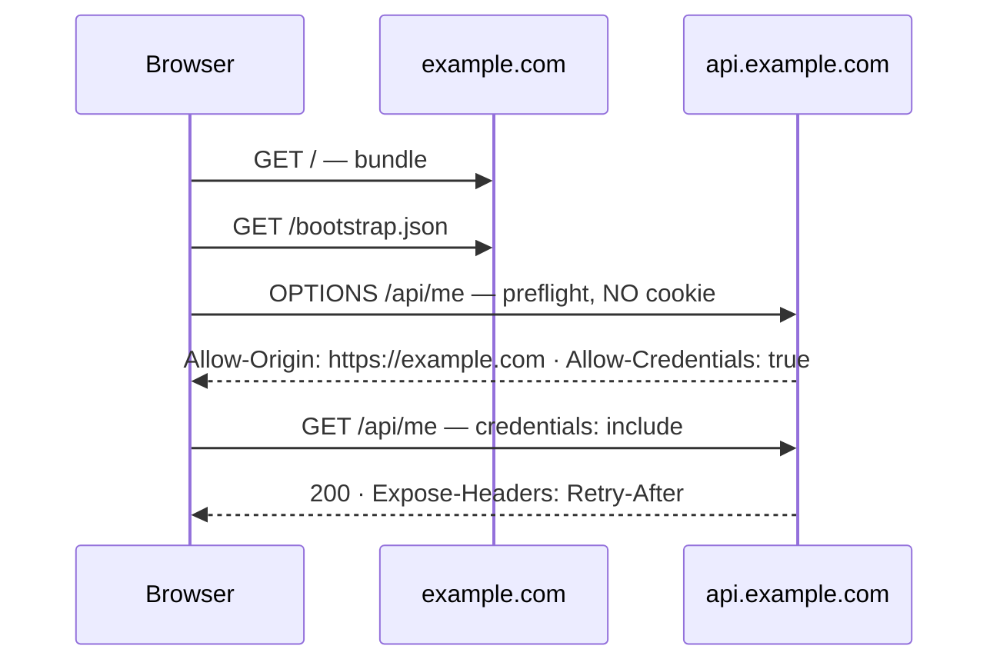
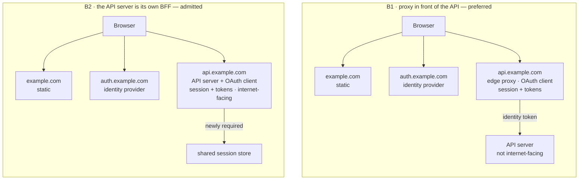

# Authentication: the identity tier, the token, and the session

One of the Aurum Alpha engineering standards, written under the platform
contract ([`000-platform.md`](000-platform.md)). It is a per-capability standard
from that contract's roster. Read [`999-enforcement.md`](999-enforcement.md) for
the tier each rule below actually holds. Artifacts:
[`contracts/auth/`](../contracts/auth/).
[`solutions/060-auth.md`](../solutions/060-auth.md) names which proxy modules and
providers are known to satisfy these rules, and when that was last checked. It
states no rule of its own.

This document governs how a person is authenticated, and what identity reaches
an application as a result. It also governs how that identity is first created,
and how a session ends. **It does not define the authorization model**. Who is
permitted to do what belongs to the [RBAC standard](070-rbac.md), and the
boundary between the two is AU6.

## Why this exists

Seven products in the portfolio authenticate users, and they do it four
different ways. Five use `passport` with `express-session`. Two still have a
prototyping platform's hosted OIDC wired into production. One uses Keycloak,
and one uses bespoke JWT.

That is the condition the CI standard was written to end, at a layer the CI
standard does not reach. Authentication is the worst place in a system to
re-litigate a decision. It is the one subsystem where a wrong answer is not a
bug but a breach. The mistakes are subtle, and four implementations means four
things to audit and four things to get right.

Two of those four are also *leased*. They authenticate against the identity
provider of a development platform the product was prototyped on. That is a
live third-party dependency in the login path of software we operate.

The governing idea already existed, correctly argued, in one legacy
application's rules directory: **the identity provider authenticates and the
application authorizes**. This document lifts it out, generalises it, and
states what follows.

## The rules

### AU1. Authentication is a tier in front of the application, not a library inside it

**A reverse proxy is the OpenID Connect relying party**. It runs the
authorization code flow with PKCE, holds the tokens, owns the session, and
fronts the application. The application server is never an identity provider and
is never in the authentication chain.

This is the Backend-For-Frontend pattern of
[RFC 10017 / BCP 212](https://www.rfc-editor.org/rfc/rfc10017.html). The RFC
defines three patterns and says the BFF is **"strongly recommended for business
applications, sensitive applications, and applications that handle personal
data"**. That describes essentially everything this organisation builds.
Adopting it is therefore the profile PC2 asks for, not a preference.

**The proxy is strongly preferred and application code is not forbidden**. RFC
10017 does not require the BFF to be a proxy. A Node or Go process doing the
job is a legitimate reading of the pattern.

This standard prefers the proxy for reasons that hold across every product. The
backend stays smaller, and authentication is a tier the application never links
against. The whole capability arrives as configuration rather than as a runtime
we must maintain, which is what PC1 asks of every opinion here. Established
OIDC modules for the common reverse proxies satisfy it with no first-party code
at all. [`solutions/060-auth.md`](../solutions/060-auth.md) names which, and
when that was last checked.

An application-code BFF is admitted where a repository states the reason in its
**Conventions**. AU7 sets out what that choice costs.

#### The application does talk to the provider, on one plane only

This looks like a contradiction and is not. *Never in the authentication chain*
is a statement about the data plane.

- **Control plane**: the application calls the provider directly, to provision
  identities (AU4). This is deliberate and admin-triggered, and it is where the
  application's own credential for the provider lives.
- **Data plane**: the application never calls the provider. It validates what
  the proxy hands it and nothing else.

These are two conversations with the same system. The provisioning adapter is
the first and is not a violation of the second.



### AU2. One signed identity token crosses the proxy to the backend

Three forms could cross that hop. Two are admitted and one is discouraged,
because they differ in what the backend is actually trusting.

| | What crosses | The backend validates | Admitted |
|---|---|---|---|
| **(a)** | The provider's access token, forwarded as a bearer | against the provider's JWKS | yes |
| **(b)** | A signed identity token the proxy mints | against the proxy's key | **yes, preferred** |
| **(c)** | Plain injected headers | nothing | **discouraged** |

**(b) is preferred** because it is an intermediary data standard. The backend
receives one identity shape whatever provider sits behind the proxy. That is
what makes providers swappable in practice rather than in principle.

**(a) and (b) both require the backend to verify the signature**, not merely
decode the token. The backend must also enforce expiry and handle key rotation.
A parsed but unverified token is no check at all.

**(c) is admitted only where network isolation is stated and enforced**, and it
is a migration source rather than a target. Injected headers carry no
signature. Authentication then rests entirely on nothing being able to reach
the backend except through the proxy. That is a topology property, holding up
an authentication guarantee, and it is usually written down nowhere.

**Forbidden in all cases: any browser-based OIDC client requiring a credential
compiled into a frontend bundle**. No client secret, no provider credential,
nothing that lets a page complete an exchange itself. Native and mobile clients
are a separate case with no same-origin model to lean on, and they are out of
scope here.

#### The claim set

The token of (b), shaped by
[`contracts/auth/identity-token.schema.json`](../contracts/auth/identity-token.schema.json):

```json
{
  "iss": "https://rp.aurumalpha.dev",
  "aud": "billing-api",
  "exp": 1788312045,
  "iat": 1788311745,
  "jti": "01923e8a-7f4e-7cc3-9a2b-3f8d2c1b0a99",
  "auth_time": 1788309000,
  "amr": ["pwd", "otp"],
  "identity": {
    "issuer":  "https://id.aurumalpha.dev/realms/aurum",
    "subject": "f7c1d2e8-5a44-4b91-9c3e-2d8a1b0f6e77",
    "email": "someone@example.com",
    "email_verified": true,
    "name": "Someone Example"
  },
  "session_id": "8fK2mQ7xW3pLzR"
}
```

Each field is a decision:

- **`iss` is the proxy, not the identity provider**. It names who signed this
  token, which is what the backend validates against. The identity's own issuer
  is nested, because `(issuer, subject)` is the link key of AU3 and has to travel
  as a unit. Flattening them is how an application ends up keying on the wrong
  issuer.
- **`aud` names the application and is enforced**. Without that check, a token
  minted for one application replays against another.
- **`exp` is short**. Five minutes, because this is an internal hop rather than
  a user session. This is also the backstop of AU5.
- **`auth_time` and `amr`** are present so an application can require step-up
  for a sensitive operation without needing to understand how authentication
  happened.
- **`session_id`** is present for correlation and for back-channel logout.
- **`identity.email` and `identity.name` are cached display attributes**. They
  are never keys, per AU3.
- **Nothing about authorization appears**. No roles, no groups, no permissions,
  no tenant assignment. A token carrying them would make every application's
  access control depend on provider configuration. That is the failure this
  standard exists to prevent.

**One convention conflict, stated rather than left silent**. Registered JWT and
OIDC claims keep their RFC spelling and NumericDate encoding: `exp`, `iat`,
`auth_time`, `amr`. This holds even though
[`020-identifiers.md`](020-identifiers.md) IP4 otherwise minimises Unix-epoch
timestamps. Adopting a standard whole is what PC2 asks, and renaming half a
registered claim set breaks every library that reads it. Locally added claims
follow the same conventions: snake_case, and RFC 3339 where they carry a time.

### AU3. An application stores a reference to the subject, never adopts it as a key

Three values do three different jobs. Conflating them is what produces
migration disasters.

| Value | Its job | The rule |
|---|---|---|
| `(issuer, subject)` | **The identity.** | The only value stored as the link. Opaque, never displayed, never parsed. |
| Email | The matching key at provisioning, the invitation channel, a cached display attribute. | **Never a foreign key.** Unique and verified within the identity domain. |
| Username | The provider's login handle, where a domain uses one. | Never crosses to the application as an identifier. |

So *email or username* resolves to: both are used, for different jobs, and
neither is the identity.

**The application keeps its own user primary key**. Per IP1, an externally
minted identifier is not the application's own. Beside it, the application
keeps an identity-link record holding `(issuer, subject)`. The external key is
the **pair**, never `subject` alone. OIDC guarantees a subject is unique and
never reassigned only *within* an issuer.

A provider migration is then: add a second link row per user, cut over, drop the
first. Application ids never move, foreign keys never break, and a user can hold
two identities during the overlap. **An application that keyed its user table on
the subject cannot do any of that**. It has silently given up the swappability
AU2 was arranged to preserve.

Two consequences are stated here so nobody helpfully undoes them:

- **Email uniqueness is enforced at the provider, and verified**. Otherwise a
  second unverified account on the same address exists, and the matching key
  stops matching one person. Every provider has a setting for this. The
  register names where it lives per provider.
- **A person changing their email costs nothing**. The subject does not change,
  the link holds, and no foreign key moves. That is the payoff for not keying
  on it.

**Pin the subject identifier type to `public`**. OIDC defines two. Under
`pairwise` the provider issues *a different subject to each client for the same
human*. Two applications then cannot tell they are looking at the same person.
A portfolio of applications behind one provider that expects identity to line up
requires `public`. It is also exactly the provider setting someone changes
without knowing what it costs.

Machine identity, such as service accounts and workload credentials, is a
separate thing. None of the above governs it.

### AU4. Users are created in the application, and the application creates the identity

The classic enterprise picture has the directory as the source, pushing down into
applications. **That is backwards for what we build**. A user becomes valid in an
application because an admin added them *there*. That is also where the roles
are decided. The provider has no concept of what a role means in any
application, and therefore cannot confer one.



The application receives the subject in the creation response, so **the identity
link exists before the person has ever logged in**. There is no roster to
reconcile and no matching bug waiting to happen.

#### The four operations

They are stated language-neutrally. An adapter implements them over SCIM, the
provider's admin API, or anything else that satisfies the semantics. **Both are
admitted, because the Aurum Alpha standard is the interface and not the
transport**. A gate that checked which was used would be testing the
implementation rather than the boundary, which PC4 forbids. SCIM alone would
not suffice regardless. Its user schema covers the account and none of the
first-login actions, the invitation, or the access grant.

| Operation | Semantics |
|---|---|
| `ensureIdentity(person) → (issuer, subject)` | Idempotent. Creates if absent, returns the existing identity if present. **Never assumes ownership**: a second application inviting the same human reuses the account. |
| `grantAppAccess(subject)` | Sets the coarse gate on this application's registration at the provider. |
| `revokeAppAccess(subject)` | Removes this application's grant and its local record. **Never disables the identity.** |
| `sendInvitation(subject, actions)` | Triggers the first-login flow: verify email, set a password, enrol MFA. |

**The application sends the invitation by default**, and it is permitted to
defer to the provider. It is that way round because the message names the
application and carries its branding, which provider-sent mail usually cannot.
Deferring is cheaper and stays admitted, stated in the repository's
**Conventions**.

#### One provider account, many applications

- **Creation is idempotent and never claims ownership**.
- **An application is permitted to revoke its own access and is never
  permitted to disable the identity**. Disabling is an organisational
  offboarding action with its own trigger, and no application admin performs
  it.
- **Profile attributes belong to the provider**. They are written at creation
  and not fought over afterwards.

From the application's side the user is deleted, and that is the whole truth
available to it. Whether that person still holds permissions in other
applications is **not knowable to it and not its concern**. This is
definitional: knowing would require reading another application's authorization
state, which is the coupling this separation exists to prevent.

*User deleted in application A* and *identity still active at the provider* are
simultaneously correct, and are not drift.

#### Where the provider is the source instead

Where an HR or identity-governance system owns the workforce lifecycle, it
provisions **into** the provider. That is what a provider's own SCIM support is
for. Applications then learn of a person by roster sync or on first login. That
is a third case, admitted, and it does not change anything above for
application-initiated users.

### AU5. Sessions end, and revocation does not wait for them to

- **Idle timeout eight hours; absolute maximum seven days**. Eight, so that a
  working day does not log someone out at lunch. The absolute cap, because an
  idle timer alone never ends a session somebody keeps warm.
- **Refresh is invisible to the browser**. The proxy holds the refresh token,
  rotates it on each use, and renews the access token behind the unchanged
  session cookie. A failed refresh drops the session, so the next request
  redirects to login.
- **Revocation uses OIDC Back-Channel Logout**. The provider posts a logout token
  to the proxy and the proxy destroys the session. It is the standard for exactly
  this, so PC2 says adopt it rather than invent a polling scheme.
- **The short access token is the backstop**. At five minutes (AU2), a disabled
  identity stops working within one refresh cycle even where back-channel logout
  is unsupported or broken. That bounds the damage without depending on a
  mechanism that might not fire.
- **Logout is RP-initiated**: destroy the local session *and* call the provider's
  end-session endpoint. Skipping the second means the user clicks login and is
  silently signed straight back in. That reads as the logout button not working.

A repository needing tighter numbers sets them in its **Conventions** and says
why. Looser than the above needs the same, and a harder argument.

### AU6. An authenticated subject the application does not know is refused, and logged out

An identity created at the provider grants nothing. A user exists in an
application only because an admin added them there (AU4), so an authenticated
subject with no local user is refused.

**How it is refused matters, and the obvious answer is wrong**.



A `401` means *you are not authenticated*, and this person is. So the provider
signs them straight back in and returns them to the same refusal, forever. The
correct answer is **`403` plus session termination**.

#### The boundary with authorization

Everything past *known subject* belongs to the
[RBAC standard](070-rbac.md): the permission model, the
grant semantics, the check operation and its corpus. This document stops at
producing a trustworthy subject and refusing an unknown one.

What this standard does fix is **what the client is told**, because it is the
authentication session that makes the answer possible. A client fetches its own
identity and permissions at load, shaped by
[`contracts/auth/me.schema.json`](../contracts/auth/me.schema.json):

- `user`: the application's own public id (IP1), plus OIDC's registered claim
  names for display.
- `permissions`: a flat list the interface can test against.
- `roles`: for showing someone what they are, not for branching on.
- `entitlements`: what the session's tenant has bought, derived under the
  [billing standard](075-billing.md) BL4. That is the plan, the capabilities,
  and the quotas, allowances and settings by metric. Present wherever a product
  sells plans; as advisory as `permissions`, and for the same reason.
- `session`: when it expires, so the client can warn before it lapses, and
  the tenant it is bound to (AU8).

**The client uses permissions and entitlements to decide what to render, never
to decide what is allowed**. Every one is enforced again on the server, on
every request. The permission is enforced by `check` under 070, and the
entitlement by the billing standard's check beside it. A client that hides a
button has improved the experience. A server that trusts the client having
hidden it has a vulnerability. This is stated in exactly those words because
the endpoint makes the wrong reading available for the first time.

A `403` is also the signal that a cached copy is stale. The client refetches
once before showing an error, because someone most likely changed the person's
roles while the page was open.

No standard covers this shape, and two were checked, per PC2. **OIDC's
UserInfo** returns identity claims only, carries nothing about application
authorization, and belongs to the provider, which the browser cannot reach.
**SCIM's `/Me`** returns a directory resource, with the same gap. The envelope
is therefore a portfolio contract. The identity fields inside it reuse OIDC's
registered claim names rather than inventing parallel spellings.

### AU7. The topology is one of three, and each states its cookie and CORS posture

#### A · One origin, path-based — the default

Everything the browser touches shares an origin. The cookie carries the
`__Host-` prefix and CORS never enters the picture.



#### B · Split across subdomains — admitted, and it costs three things



- **The cookie widens**. It must carry `Domain=example.com` to reach the API
  host, so `__Host-` is unavailable and `__Secure-` takes its place. Every
  subdomain can now send it, which is a real increase in blast radius.
- **Preflight is uncredentialed**. `OPTIONS` arrives with no cookie by
  specification. A proxy requiring a session on all methods rejects it, and the
  failure surfaces as an opaque CORS error rather than a `401`.
- **Response headers stop being readable**. Script reads only a small safelist
  unless the server names others in `Access-Control-Expose-Headers`. **This
  silently breaks [`050-http.md`](050-http.md) HA7**. The client cannot see
  `Retry-After`, so the rule that it wins over the client's own backoff quietly
  stops applying, in this topology only.

| Header | What it must say |
|---|---|
| `Access-Control-Allow-Origin` | The exact origin. **Never `*`**: it is illegal alongside credentials, and the browser rejects the response. |
| `Access-Control-Allow-Credentials` | `true`, or the cookie is not sent. |
| `Access-Control-Allow-Headers` | `Content-Type` and **`Idempotency-Key`**. Omitting the second breaks HA6 in this topology alone. |
| `Access-Control-Expose-Headers` | `Retry-After` and the request-id header. |
| `Access-Control-Max-Age` | Set it, or every request pays for a round trip it did not need. |
| `Vary` | `Origin`, whenever the allowed origin is echoed rather than fixed. Without it a shared cache serves one origin's response to another. |

**The split stays inside one registrable domain**. `example.com` and
`api.example.com` are same-site, so `SameSite=Lax` still sends the cookie.
Splitting across *different* registrable domains makes the session a third-party
cookie. Safari blocks those outright, and Chrome's plans for them have reversed
more than once. A session credential is not something to bet on that, so that
arrangement is not admitted.

#### Where the OAuth client sits, in topology B

Two variants, and only one box differs between them.



| | B1 · proxy | B2 · application code |
|---|---|---|
| The OAuth client is | the proxy at the edge | the API server |
| Tokens live | in the proxy, never in application memory | in the application process |
| The API server receives | a signed identity token | its own session |
| API server internet-facing | no | yes |
| Scaling out horizontally | the proxy's concern | needs a shared session store or sticky sessions |
| An OIDC library as a runtime dependency | none | one, per language |
| **Adding a second backend** | **covered by the same proxy** | **implemented again, in the other language** |

The last row is what decides it for applications in four languages. Under B1
one proxy configuration covers a Go backend and a TypeScript backend against one
identity. Under B2 it is the same authentication logic written twice, with two
libraries on two upgrade schedules. The second copy is where behaviour quietly
diverges.

**B2 remains admitted** with the reason stated in **Conventions**. It is
genuinely simpler for a single-backend product and for local development. It is
not the default because its costs are paid permanently and its saving is paid
once.

### AU8. A session is an authentication into exactly one tenant

Where a product has tenants, **a tenant is an authentication boundary, and a
role is an authorization boundary inside one**. The two sentences decide
everything below, and they decide which standard owns what. This document
binds a session to a tenant. The [RBAC standard](070-rbac.md) decides what a
subject is permitted to do inside it, and reads the tenant from the session
(RB10).

- **A session is bound to one tenant at login and never changes it**. The
  binding is made when the session is created, from the tenant the entry
  point belongs to. It is recorded in the session, not inferred later. A
  person who works in two tenants authenticates twice and holds two sessions.
  There is no *switch tenant* inside a session. A switch is a new binding,
  which is a new login.
- **This is true whatever the topology**. A product serving every tenant from
  one host under AU7's topology A still binds each session to one tenant. A
  product giving tenants their own hostnames under the
  [tenant hostnames standard](092-tenant-hostnames.md) makes the same binding
  on a host-only cookie. A session for one tenant's host is then never
  presented to another's.
- **The session cookie is host-only wherever hosts differ by tenant**.
  `Domain=` is never set on it, so the browser scopes it to the exact host
  that set it. Topology B's widened cookie is admitted for one product's
  `app.` and `api.` hosts and is not admitted across tenant hosts. A cookie
  that reaches every tenant's host is a credential for the wrong tenant
  waiting for a routing mistake.
- **An identity in several tenants is not a session in several tenants**. The
  identity link of AU3 can exist in more than one tenant's user table; the
  session names one of them. Which one is decided by where the person logged
  in, never by a choice the client sends afterwards.
- **A subject with no user in the session's tenant is refused as AU6 says**:
  `403`, session ended. That the same identity has a user in another tenant
  changes nothing here.

The reason the binding is fixed rather than switchable is RB7's. A check is a
pure function of subject, permission and scope, and the scope has to come from
somewhere the caller cannot choose. A session that can change tenant on request
is ambient state by another name. The cross-tenant cache defect RB7 describes
returns through it.

Roles are unaffected. A person with three roles in one tenant has one session
and three grants. The roles are 070's and the session does not know them.

## The artifacts

Per PC3, under [`contracts/auth/`](../contracts/auth/):

- **`identity-token.schema.json`**: the AU2 claim set, `$ref`-ing the
  identifiers contract for its subject format.
- **`me.schema.json`**: the AU6 client identity document.
- **`corpus.json`**: validity cases for both, plus behavioural cases a live
  deployment must satisfy.

## Enforcement

Every rule is review-only today, with gates named per rule in
[`999-enforcement.md`](999-enforcement.md). The honest summary: **the parts
with a wire are gateable and the parts that are architecture are not**.

- **AU2 is the strongest available gate**. The identity token is a wire shape,
  so a corpus validates it. *Signature verified rather than merely decoded* is
  testable by presenting a token signed with the wrong key and requiring a
  refusal.
- **AU6's refusal is a live behaviour case**: authenticate as a subject with no
  local user and require `403` with the session ended, never `401`.
- **AU7's cookie attributes and CORS headers are observable from outside**. A
  login response's `Set-Cookie` and a preflight's answer either carry what the
  tables above require or they do not.
- **AU1 resists a checker entirely**. Whether authentication sits in a tier or
  in the application is an architecture question. A gate that read the source
  to answer it would be the PC4 violation. The review question is stated
  instead: *which process is the OAuth client, and what holds the tokens*.
- **AU3, AU4 and AU5 are review questions** for the same reason. They govern
  where state lives and who is permitted to change it, neither of which appears
  at a boundary a gate can watch.

## Decisions

- **BFF as the default, not one option of three** (2026-09-01): the alternative
  was to describe all three RFC 10017 patterns neutrally. Each product would
  then choose, which is what "we use OIDC" unpinned looks like. The RFC's own
  recommendation language settles which is the default for software that
  handles personal data.
- **A proxy preferred, application code admitted** (2026-09-01): an earlier
  draft mandated the proxy. That over-reached. RFC 10017 permits an
  application-code BFF, and it is genuinely the simpler choice for a
  single-backend product. The preference is stated with its cost table instead
  of as a prohibition.
- **(b) preferred over (a) for the backend hop** (2026-09-01): a proxy-minted
  identity token is an intermediary data standard. It gives every backend one
  shape regardless of provider. (a) keeps the backend a real OAuth resource
  server and is admitted. (c) is discouraged because it converts a network
  assumption into the sole authentication control.
- **A shared user directory in the proxy was considered and rejected**
  (2026-09-01): the proxy would resolve to a shared user id before minting.
  That hides the provider from applications entirely, and it requires the proxy
  to own a user directory. That is a great deal more than a proxy, and the beginning of the
  framework PC1 forbids.
- **Eight hours idle, seven days absolute** (2026-09-01): chosen for a working
  day rather than derived from a threat model. A repository with a sharper
  threat model sets its own and says why. The value of a standard default is
  that products without one stop inventing.
- **Multi-tenancy at the provider is out of scope** (2026-09-01): three
  different shapes solve the same problem. They are Auth0 Organizations, a
  Keycloak realm per customer, and a single realm with groups. Which is right depends on
  the provider and on the commercial architecture rather than on this contract.
- **The session's tenant binding is in scope, and it is one tenant per
  session** (2026-09-08): the entry above left multi-tenancy wholly to the
  provider. That was too much: how a provider models tenants is still not
  this document's business, but whether a session can span or switch tenants
  is. It decides the scope argument 070 RB7 needs and the cookie attributes
  AU7 pins. Tenant hostnames made the question concrete: a
  person on one tenant's host presenting a session made on another's. The
  answer that keeps the check pure is a binding made once at login. The
  alternative, an active-tenant selector in the session, is the ambient-scope
  design RB7 already rejects.
- **`/me` carries entitlements beside permissions** (2026-09-08): a client
  that sells plans needs to know what the tenant bought to decide what to
  draw. The only alternative to carrying it here was a second bootstrap
  document. It is added under the same advisory rule as `permissions`, and
  the vocabulary is the [billing standard](075-billing.md)'s, not this
  document's.
