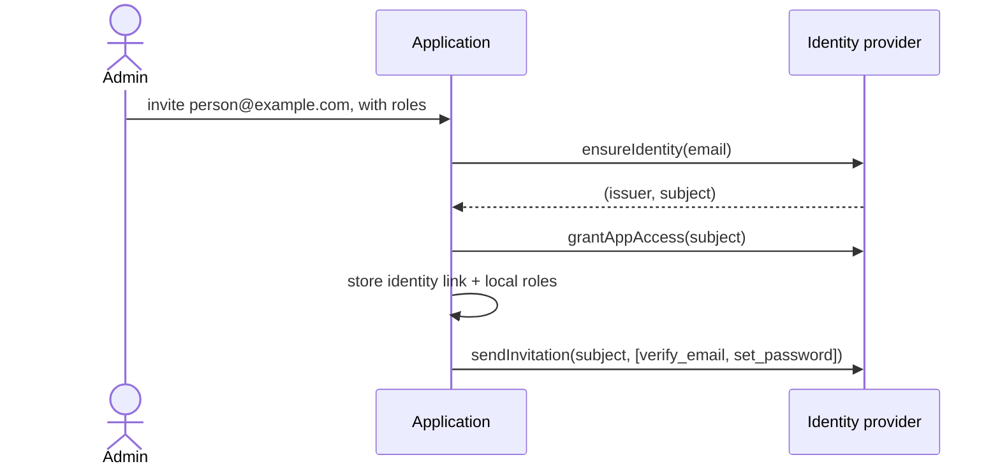
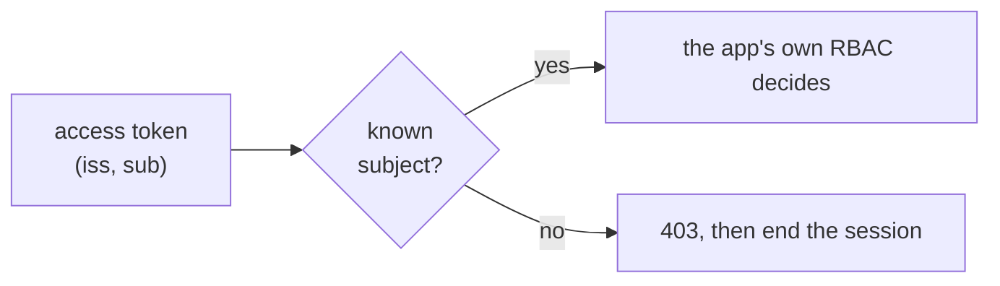
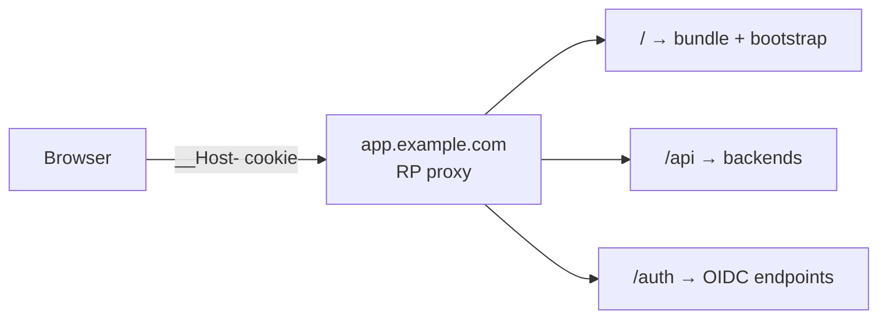
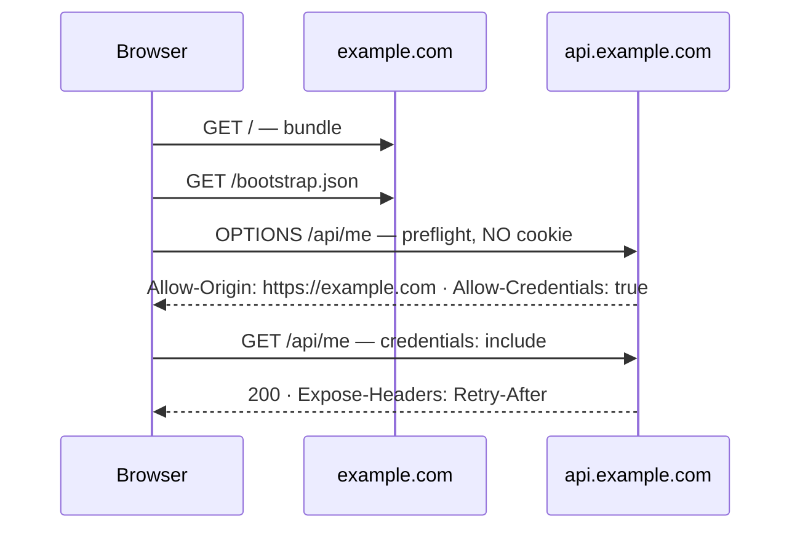
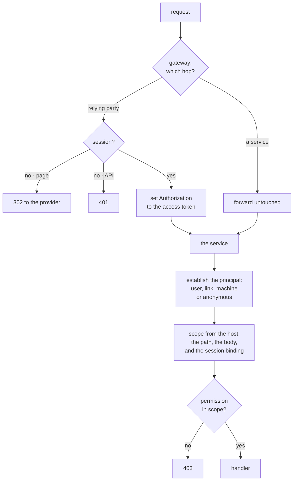

# Authentication: the identity tier, the token, and the session

## Why this exists

Every product authenticates people, and without a standard each decides
alone how. The answers on offer are a session library inside the
application, a hosted provider wired into the code, or a bespoke token
scheme. Authentication is the one subsystem where a wrong answer is a
breach, and every further implementation is one more thing to audit. The
governing idea is one
sentence: **the identity provider authenticates and the application
authorizes**. This document states it, generalises it, and states what
follows.

## The rules

### AU1. Authentication is a tier in front of the application, not a library inside it

**A reverse proxy is the OpenID Connect relying party**. It runs the
authorization code flow with PKCE, holds the tokens, owns the session, and
fronts the application. The application server is never an identity provider and
is never in the authentication chain.

This is the Backend-For-Frontend pattern of
[RFC 10017 / BCP 212](https://www.rfc-editor.org/rfc/rfc10017.html). The RFC
defines three patterns and says the BFF is **"strongly recommended for business
applications, sensitive applications, and applications that handle personal
data"**. That describes essentially everything this organisation builds.
Adopting it is therefore the profile PC2 asks for, not a preference.

**The proxy is strongly preferred and application code is not forbidden**. RFC
10017 does not require the BFF to be a proxy. A Node or Go process doing the
job is a legitimate reading of the pattern.

This standard prefers the proxy for reasons that hold across every product. The
backend stays smaller, and authentication is a tier the application never links
against. The whole capability arrives as configuration rather than as a runtime
we must maintain, which is what PC1 asks of every opinion here. Established
OIDC modules for the common reverse proxies satisfy it with no first-party code
at all. [`solutions/060-auth.md`](../solutions/060-auth.md) names which.

An application-code BFF is admitted where a repository states the reason in its
**Conventions**. AU7 sets out what that choice costs.

#### The application does talk to the provider, on two planes, and one of them is narrow

*Never in the authentication chain* is a statement about the token lifecycle.
The application performs no code exchange, no refresh, no rotation, no
revocation and no session management. Every one of those belongs to the proxy.

- **Control plane**: the application calls the provider directly, to provision
  identities (AU4). This is admin-triggered, and it is where the
  application's own credential for the provider lives.
- **Data plane**: the application fetches the provider's public keys, and
  makes no other call. Verifying a signature needs the key that made it, so
  key distribution is the one contact the data plane has. It is stated here
  rather than left as an unwritten exception to the rule above.

Three operational notes follow from that one call. The keys are cached, so a
request does not wait on the provider. An unknown `kid` triggers one refresh,
throttled, because an attacker choosing key identifiers otherwise chooses how
often the backend calls out. A provider the backend cannot reach is reported
as degraded rather than failing readiness. A cached key set keeps serving
every token it already covers.

### AU2. The credential is the provider's access token, and the backend verifies it

There is one way an application receives identity. It is the identity
provider's access token, forwarded by the relying party, in the form
[RFC 9068](https://www.rfc-editor.org/rfc/rfc9068.html) defines.

This is what [RFC 10017 / BCP 212](https://www.rfc-editor.org/rfc/rfc10017.html)
describes, and AU1 already adopts that document whole. Section 6.1 gives the
relying party's third responsibility as forwarding requests to a resource
server, augmenting them with the correct access token. The RFC names no other
token on that hop.

**The token's shape is RFC 9068's and this standard adds nothing to it**.
There is no claim set here, and no contract in this repository describes one.
The RFC states which claims a JWT access token carries and which are
optional, and a provider emits what it emits.

**The proxy does not mint a token of its own**. An intermediary shape the
proxy signs is an internal contract. PC2 admits one only where no standard
suffices. [RFC 8707](https://www.rfc-editor.org/rfc/rfc8707.html)
and [RFC 9700 / BCP 240](https://www.rfc-editor.org/rfc/rfc9700.html) section
2.3 restrict the audience to the one backend.
[RFC 8693](https://www.rfc-editor.org/rfc/rfc8693.html) covers the swap case,
and in it the authorization server mints rather than the proxy.

**Plain injected headers are not admitted.** A header carries no signature,
so there is nothing for the backend to verify. Authentication would rest
entirely on nothing being able to reach the backend except through the proxy.
That is a topology property holding up an authentication guarantee, and it is
written down nowhere.

**Forbidden: any browser-based OIDC client requiring a credential compiled
into a frontend bundle**. No client secret, no provider credential, nothing
that lets a page complete an exchange itself. Native and mobile clients are a
separate case with no same-origin model to lean on, and they are out of scope
here.

**The backend verifies the token per RFC 9068 section 4**, against the
provider's JWKS. A parsed but unverified token is no check at all. Key
rotation is AU1's. Presentation is
[RFC 6750](https://www.rfc-editor.org/rfc/rfc6750.html)'s
`Authorization: Bearer`; where the proxy puts the access token in another
header, the repository names that header in its **Conventions**.

#### Why the backend's job is this small

A session binds a credential to a known user and a known source. That binding
is authentication, and it belongs to the tier, along with the caching that
stops a person logging in on every request. The application asks the token
one question: who is authenticated. Where the request came from is a real
concern and it is the proxy's. The application's own code concerns itself
with authorization, which is [`070-rbac.md`](070-rbac.md)'s.

#### What this standard reads, and what it never reads

The rules below name the claims they depend on. That is a statement about
those rules, never a redefinition of the token.

| Claim | Read by | For |
|---|---|---|
| `iss` and `sub` | AU3 | The link key. RFC 9068 requires both. |
| `sid` | AU8 | The login session a tenant binding hangs on. |
| `email`, `email_verified`, `name` | AU3, AU4 | Display, and the provider-is-source condition. Never keys. |

**Nothing here reads how or when the person authenticated.** Not `auth_time`,
not `amr`, not `acr`. Those describe the authentication, which is the tier's
subject and never the application's. Where an operation needs a fresh
authentication, the route is declared as requiring one and the relying party
runs it before the request arrives (AU9).

`sid` is the one claim in that table RFC 9068 does not require, so a provider
emits it because someone configured it to.
[`solutions/060-auth.md`](../solutions/060-auth.md) carries the checklist.

**Nothing reads `roles`, `groups`, `entitlements` or `scope`**. A provider
emits what it is configured to emit. The token is well formed with any of
them present. Reading one would make every application's access control
depend on provider configuration. That is the failure this standard exists to
prevent, and no schema can hold the rule because the claims are legal.

**One convention conflict, stated rather than left silent**. Registered JWT
claims keep their RFC spelling and NumericDate encoding: `exp` and `iat`.
This holds even though
[`020-identifiers.md`](020-identifiers.md) IP4 otherwise minimises Unix-epoch
timestamps. Adopting a standard whole is what PC2 asks, and renaming half a
registered claim set breaks every library that reads it.

### AU3. An application stores a reference to the subject, never adopts it as a key

Three values do three different jobs. Conflating them is what produces
migration disasters.

| Value | Its job | The rule |
|---|---|---|
| `(iss, sub)` | **The identity.** | The only value stored as the link, read straight off the token. Opaque, never displayed, never parsed. |
| Email | The matching key at provisioning, the invitation channel, a cached display attribute. | **Never a foreign key.** Unique and verified within the identity domain. |
| Username | The provider's login handle, where a domain uses one. | Never crosses to the application as an identifier. |

**The application keeps its own user primary key**. Per IP1, an externally
minted identifier is not the application's own. Beside it, the application
keeps an identity-link record holding `(iss, sub)`. The external key is
the **pair**, never `sub` alone. OIDC guarantees a subject is unique and
never reassigned only *within* an issuer.

A provider migration is then: add a second link row per user, cut over, drop the
first. Application ids never move, foreign keys never break, and a user can hold
two identities during the overlap. **An application that keyed its user table on
the subject cannot do any of that**. It has silently given up the swappability
AU2 was arranged to preserve.

Two consequences:

- **Email uniqueness is enforced at the provider, and verified**. Otherwise a
  second unverified account on the same address exists, and the matching key
  stops matching one person.
- **A person changing their email costs nothing**. The subject does not change,
  the link holds, and no foreign key moves. That is the payoff for not keying
  on it.

**Pin the subject identifier type to `public`**. OIDC defines two. Under
`pairwise` the provider issues *a different subject to each client for the same
human*. Two applications then cannot tell they are looking at the same person.
A set of applications behind one provider that expects identity to line up
requires `public`. It is also exactly the provider setting someone changes
without knowing what it costs.

### AU4. Users are created in the application, and the application creates the identity

The classic enterprise picture has the directory as the source, pushing down into
applications. **That is backwards for what we build**. A user becomes valid in an
application because an admin added them *there*. That is also where the roles
are decided. The provider has no concept of what a role means in any
application, and therefore cannot confer one.

The application receives the subject in the creation response, so **the identity
link exists before the person has ever logged in**. There is no roster to
reconcile and no matching bug waiting to happen.

#### The four operations

An adapter implements them over SCIM, the provider's admin API, or anything
else with the same semantics; the interface binds and not the transport (PC4).
SCIM alone would not suffice: its user schema covers the account and none of
the first-login actions, the invitation, or the access grant.

| Operation | Semantics |
|---|---|
| `ensureIdentity(person) → (issuer, subject)` | Idempotent. Creates if absent, returns the existing identity if present. **Never assumes ownership**: a second application inviting the same human reuses the account. |
| `grantAppAccess(subject)` | Sets the coarse gate on this application's registration at the provider. |
| `revokeAppAccess(subject)` | Removes this application's grant and its local record. **Never disables the identity.** |
| `sendInvitation(subject, actions)` | Triggers the first-login flow: verify email, set a password, enrol MFA. |

**The application sends the invitation by default**, and it is permitted to
defer to the provider. It is that way round because the message names the
application and carries its branding, which provider-sent mail usually cannot.
Deferring is cheaper and stays admitted, stated in the repository's
**Conventions**.

#### One provider account, many applications

**Profile attributes belong to the provider**. They are written at creation
and not fought over afterwards. Disabling an identity is an organisational
offboarding action with its own trigger, and no application admin performs it.

From the application's side the user is deleted, and whether that person still
holds permissions in other applications is not knowable to it. Knowing would
require reading another application's authorization state, which is the
coupling this separation exists to prevent.

#### The provider-is-source mode

Everything above is the default provisioning mode: an administrator creates the
user, and the application creates the identity. There is a second mode, named
**provider-is-source**, and a repository declares which one it runs in its
**Conventions**. In it the provider owns the lifecycle, and the application
learns of a person on first login.

Two shapes reach it. An HR or identity-governance system provisions **into** the
provider, which is what a provider's own SCIM support is for. A self-service
product lets a person register at the provider with no directory behind it.

**Two conditions hold, and the mode needs both of them:**

- **The email is verified.** `email_verified` is true in the token of AU2. An unverified address is a claim about a mailbox that belongs to
  somebody else.
- **The product declares the grant a new person receives**, as a role and a
  scope under [`070-rbac.md`](070-rbac.md) RB5. Without it an authenticated
  stranger becomes a user with no decision behind it.

**The control plane is off in this mode.** The four operations above are not
called, because the application is not the source. The application writes its
own user record and its identity link on first login, and it changes nothing at
the provider.

### AU5. Sessions end, and revocation does not wait for them to

- **Idle timeout eight hours; absolute maximum seven days**. Eight, so that a
  working day does not log someone out at lunch. The absolute cap, because an
  idle timer alone never ends a session somebody keeps warm.
- **Refresh is invisible to the browser**. The proxy holds the refresh token,
  rotates it on each use, and renews the tokens it forwards behind the unchanged
  session cookie. A failed refresh drops the session, so the next request
  redirects to login.
- **Revocation uses OIDC Back-Channel Logout**. The provider posts a logout token
  to the proxy and the proxy destroys the session. It is the standard for exactly
  this, so PC2 says adopt it rather than invent a polling scheme.
- **The short access token is the backstop**. At five minutes (AU2), a
  disabled identity stops working within one refresh cycle even where
  back-channel logout is unsupported or broken. That bounds the damage without depending on a
  mechanism that might not fire.
- **Logout is RP-initiated**: destroy the local session *and* call the provider's
  end-session endpoint. Skipping the second means the user clicks login and is
  silently signed straight back in. That reads as the logout button not working.

A repository needing tighter numbers sets them in its **Conventions** and says
why. Looser than the above needs the same, and a harder argument.

### AU6. An authenticated subject the application does not know is refused, and logged out

An identity created at the provider grants nothing. A user exists in an
application only because an admin added them there (AU4), so an authenticated
subject with no local user is refused. This is the rule of AU4's default
provisioning mode. Under provider-is-source the application writes the user on
first login, so no unknown subject reaches this refusal.

A `401` means *you are not authenticated*, and this person is. So the provider
signs them straight back in and returns them to the same refusal, forever. The
correct answer is **`403` plus session termination**.

#### The boundary with authorization

Everything past *known subject* belongs to the [RBAC standard](070-rbac.md).

What this standard does fix is **what the client is told**, because it is the
authentication session that makes the answer possible. A client fetches its own
identity and permissions at load, shaped by
[`contracts/auth/me.schema.json`](../contracts/auth/me.schema.json):

- `user`: the application's own public id (IP1), plus OIDC's registered claim
  names for display.
- `permissions`: a flat list the interface can test against.
- `roles`: for showing someone what they are, not for branching on.
- `entitlements`: what the session's tenant has bought, derived under the
  [billing standard](075-billing.md) BL4. That is the plan, the capabilities,
  and the quotas, allowances and settings by metric. Present wherever a product
  sells plans; as advisory as `permissions`, and for the same reason. The
  alternative was a second bootstrap document.
- `session`: when it expires, so the client can warn before it lapses, and
  the tenant it is bound to (AU8).

**The client uses permissions and entitlements to decide what to render, never
to decide what is allowed**. Every one is enforced again on the server, on
every request. The permission is enforced by `check` under 070, and the
entitlement by the billing standard's check beside it. A client that hides a
button has improved the experience. A server that trusts the client having
hidden it has a vulnerability.

No standard covers this shape, and two were checked, per PC2. **OIDC's
UserInfo** returns identity claims only, carries nothing about application
authorization, and belongs to the provider, which the browser cannot reach.
**SCIM's `/Me`** returns a directory resource, with the same gap. The envelope
is therefore a shared contract of this standard's own. The identity fields inside it reuse OIDC's
registered claim names rather than inventing parallel spellings.

### AU7. The topology is one of three, and each states its cookie and CORS posture

#### A · One origin, path-based — the default

Everything the browser touches shares an origin. The cookie carries the
`__Host-` prefix and CORS never enters the picture.

#### B · Split across subdomains — admitted, and it costs three things

- **The cookie widens**. It must carry `Domain=example.com` to reach the API
  host, so `__Host-` is unavailable and `__Secure-` takes its place. Every
  subdomain can now send it, which is a real increase in blast radius.
- **Preflight is uncredentialed**. `OPTIONS` arrives with no cookie by
  specification. A proxy requiring a session on all methods rejects it, and the
  failure surfaces as an opaque CORS error rather than a `401`.
- **Response headers stop being readable**. Script reads only a small safelist
  unless the server names others in `Access-Control-Expose-Headers`. **This
  silently breaks [`050-http.md`](050-http.md) HA7**. The client cannot see
  `Retry-After`, so the rule that it wins over the client's own backoff quietly
  stops applying, in this topology only.

| Header | What it must say |
|---|---|
| `Access-Control-Allow-Origin` | The exact origin. **Never `*`**: it is illegal alongside credentials, and the browser rejects the response. |
| `Access-Control-Allow-Credentials` | `true`, or the cookie is not sent. |
| `Access-Control-Allow-Headers` | `Content-Type` and **`Idempotency-Key`**. Omitting the second breaks HA6 in this topology alone. |
| `Access-Control-Expose-Headers` | `Retry-After` and the request-id header. |
| `Access-Control-Max-Age` | Set it, or every request pays for a round trip it did not need. |
| `Vary` | `Origin`, whenever the allowed origin is echoed rather than fixed. Without it a shared cache serves one origin's response to another. |

**The split stays inside one registrable domain**. `example.com` and
`api.example.com` are same-site, so `SameSite=Lax` still sends the cookie.
Splitting across *different* registrable domains makes the session a third-party
cookie. Safari blocks those outright, and Chrome's plans for them have reversed
more than once. A session credential is not something to bet on that, so that
arrangement is not admitted.

#### Where the OAuth client sits, in topology B

Two variants, and only one box differs between them.

| | B1 · proxy | B2 · application code |
|---|---|---|
| The OAuth client is | the proxy at the edge | the API server |
| Tokens live | in the proxy, never in application memory | in the application process |
| The API server receives | the provider's access token | its own session |
| API server internet-facing | no | yes |
| Scaling out horizontally | the proxy's concern | needs a shared session store or sticky sessions |
| An OIDC library as a runtime dependency | none | one, per language |
| **Adding a second backend** | **covered by the same proxy** | **implemented again, in the other language** |

The last row is what decides it where backends are written in more than one
language. Under B1
one proxy configuration covers a Go backend and a TypeScript backend against one
identity. Under B2 it is the same authentication logic written twice, with two
libraries on two upgrade schedules. The second copy is where behaviour quietly
diverges.

**B2 remains admitted** with the reason stated in **Conventions**. It is
genuinely simpler for a single-backend product and for local development. It is
not the default because its costs are paid permanently and its saving is paid
once.

### AU8. A session is an authentication into exactly one tenant

Where a product has tenants, **a tenant is an authentication boundary, and a
role is an authorization boundary inside one**. The two sentences decide
everything below. This document binds a session to a tenant. How a provider
models tenants, a realm per customer or one realm with groups, is the
provider's and the commercial architecture's, not this document's.

- **The binding is the active grant's tenant**. A session acts in one grant,
  per [`070-rbac.md`](070-rbac.md) RB5, and that grant names a role and a
  tenant. So the tenant binding is a consequence of the active grant rather
  than a second mechanism beside it. A session still authenticates into
  exactly one tenant.
- **The binding lives per login session, and never on the user record**. Its
  key is the identity provider's session id, which AU2 carries as `sid`. Two logins by one person are two sessions, and each holds its
  own active grant. A binding on the user record makes one device's choice
  change another device's scope.
- **Whether the active grant changes inside a session is a product choice**,
  declared in the repository's **Conventions**. Where a product admits the
  change, it rebinds that session's record and writes an audit event naming
  the grant activated. Where a product does not, the session's first choice
  holds and a change of capacity is a new login. The scope comes from the
  binding either way, and never from the request.
- **This is true whatever the topology**. A product serving every tenant from
  one host under AU7's topology A still binds each session to one tenant. A
  product giving tenants their own hostnames under the
  [tenant hostnames standard](092-tenant-hostnames.md) makes the same binding
  on a host-only cookie. A session for one tenant's host is then never
  presented to another's.
- **The session cookie is host-only wherever hosts differ by tenant**.
  `Domain=` is never set on it, so the browser scopes it to the exact host
  that set it. Topology B's widened cookie is admitted for one product's
  `app.` and `api.` hosts and is not admitted across tenant hosts. A cookie
  that reaches every tenant's host is a credential for the wrong tenant
  waiting for a routing mistake.
- **An identity in several tenants is not a session in several tenants**. The
  identity link of AU3 can exist in more than one tenant's user table; the
  session names one of them. The person decides which, by the grant they
  activate, and never by a value the client sends on a request.
- **A subject with no user in the session's tenant is refused as AU6 says**:
  `403`, session ended. That the same identity has a user in another tenant
  changes nothing here.

**The binding sits in the session because the caller must not choose it**. RB7
makes the scope an argument of `check`, and RB10 says that argument is read
from the authenticated session. A tenant named by a header, a query parameter
or a body field is a tenant the caller picked. Activating a grant is an act on
the session, recorded in it and audited, and a request never carries one.

Where a hostname names the tenant, the
[tenant hostnames standard](092-tenant-hostnames.md) TH1 to TH5 continue to
hold. The host narrows which grants are candidates for the session. The binding
is still the active grant.

Roles are unaffected. A person holding three grants in one tenant acts in one
of them at a time. The grants are 070's, and the session names which one is
active.

### AU9. The gateway routes, and where a route goes is how it is authenticated

**The tier in front of an application is a gateway.** A gateway's question is
which hop comes next. It holds a routing table: a path, and the service the
request goes to. One of the services it can route to is the relying party
of AU1, which is a proxy. A request sent there has its whole login handled
there, and when the proxy is satisfied the request continues to the service
behind it.

So there is no authentication switch in the gateway. **Choosing the hop is the
authentication decision**, and everything else follows from it.

- **A route sent to the relying party** requires a user principal from the
  provider. The proxy runs the login, holds the session, and puts the access
  token of AU2 in the `Authorization` header before the request goes on.
- **A route sent straight to a service** is that service's to authenticate. It
  arrives with every header intact, because the credential the service must
  check travels in one of them.

**Public is not one of the choices.** A share link, a webhook signature and an
API key are credentials. Those routes are authenticated, just not by this
tier. The only genuinely public route is one a service takes with no
credential at all. That is a property of the service, not of the gateway.

**Every principal is a role at a scope.** One decision serves all of them. A
*user* arrives with the provider's token and holds the active grant's role and
scope. A *link* principal arrives with a token in the path the application
minted, and holds a declared role at the scope that token resolves to. A
*machine* principal arrives with a signature or a key the application
verifies, and holds a declared role at `global`. An *anonymous* principal
arrives with nothing and holds a code-declared anonymous role. Past that step
the four are one, and the check of 070 RB7 runs for each.

**Whichever tier establishes a credential owns the refusal for it.** The
relying party answers `401` for a session it could not establish. It is also
what redirects a browser to the login, because that is a proxy's act and never
the application's (AU1). A service answers `401` for a signature or a key it
could not verify. A link token that resolves to nothing is `404` and
never `403`, because "it exists but is not yours" is a disclosure.

**`403` is the application's alone.** It answers a question no gateway can
ask: this caller is known, and this act is not theirs. The scope
step reads every signal the request carries and lets none of them widen
anything. The host names a tenant (092 TH2). A path segment names a resource
or a narrower scope inside the tenant, and a body names what is acted on.
Each is a *claim* the application checks against the session's active grant
(AU8, 070 RB10). The request chooses what it asks about, never what it holds.

**The routing table is declared once, and it is the whole of the routing.** A
gateway configuration that hard-codes a product route asserts an architecture.
The one it usually asserts is a single application process. A product
serves its paths from one service or from a dozen. The table is the same shape
either way. So the table names the services, names the hop
for every path, and the gateway configuration is rendered from it.

Nothing gates that the table and the services agree about what a route needs.
Both failure cases surface the first time the route is used. A route sent
straight through that the service guards is refused by the service. A route
sent to the relying party that needed no login asks for one nobody needed.
What is worth asserting is app-specific and belongs in the repository that
owns it: that every registered route runs the authorization check at all.

An internal tool that is also a public package runs with no identity provider
by routing every path straight to its service. It is the same table and the
same code, never a second mode.

## The artifacts

Per PC3, under [`contracts/auth/`](../contracts/auth/):

- **`me.schema.json`**: the AU6 client identity document.

**There is no schema for the AU2 token, and its absence is the rule.** The
shape is RFC 9068's. A file here restating it would be a second answer to a
settled question, drifting from the RFC the moment either moved.
- **`grants.schema.json`**: the AU8 session grants view, `$ref`-ing the RBAC
  contract for the grant. It is a rendering input and never a control, and it
  carries no permission for any grant. What a grant can do is the `me`
  document's answer for the active one. Listing the others' would put a union
  on screen.
- **`corpus.json`**: validity cases for the client identity document, plus
  behavioural cases a live deployment must satisfy. Every claim about the
  token is a behavioural case, because nothing here describes its shape.

## Decisions

- **A proxy-minted identity token, as the preferred form**. One shape would
  reach every backend whatever provider sat behind the proxy, which is a real
  benefit. It is also an internal contract, and PC2 admits one only where no
  standard suffices. RFC 9068 fixes the shape, RFC 8707 and RFC 9700 restrict
  the audience, and RFC 8693 covers the swap with the authorization server
  minting. RFC 10017, which AU1 adopts whole, describes the provider's access
  token and no other (AU2).
- **The transaction-tokens draft, as the standard that would have admitted
  minting**. `draft-ietf-oauth-transaction-tokens` is the one document
  describing an edge-minted internal token. It is an Internet-Draft that has
  not reached the IESG, and it expires in January 2027. Even in it a separate
  Transaction Token Service mints, rather than the edge signing for itself.
  This is the candidate PC2 asks a standard to name (AU2).
- **Plain injected headers, admitted where network isolation is enforced**.
  Not admitted, and nothing stands in their place. A header carries no
  signature, so a backend has nothing to verify. The guarantee would rest on
  a topology property, which is the condition rather than a mitigation of it
  (AU2).
- **A contract of our own describing the RFC 9068 token**. It would pin the
  optional claims this repository's rules read, and a validator would then
  catch a misconfigured provider before a request did. It is also an internal
  contract for a shape a standard already fixes. That is the act PC2 forbids,
  and the same act as minting one size down. The provider checklist in the
  register carries the verification instead (AU2).
- **The cost of adding nothing, stated plainly**. A provider emits `roles` or
  `groups` where someone configured it to, and the token is well formed with
  them present. No schema can refuse a claim the RFC permits. So the rule
  against reading them is a rule, tested as behaviour (AU2).
- **A public-or-not switch at the gateway**. It reads well until the routes
  that are neither arrive. A share link and a webhook signature are
  credentials, so calling those routes public groups them with the one case
  that has none. A gateway told a route is public then strips the header the
  credential travels in. Routing by hop keeps the distinction the credentials
  already make (AU9).
- **The application performing the login redirect**. The gateway would forward
  everything, and an application answering `401` would trigger the relying
  party's redirect. That puts the application in the authentication chain,
  which AU1 forbids. Routing the path to the proxy is the answer (AU9).
- **A catalog gate that the table and the services agree**. A disagreement
  fails on first use in a way the operator sees. A gate would have to read
  routes to decide what a service enforces, which is the PC4 violation. What
  is worth a gate is app-specific and lives in each repository (AU9).
- **A shared user directory in the proxy**. The proxy would resolve to a
  shared user id before minting, hiding the provider from applications
  entirely. That requires the proxy to own a user directory: a great deal
  more than a proxy, and the beginning of the framework PC1 forbids.
