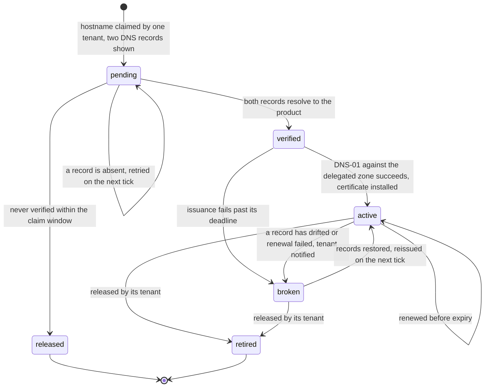

# Tenant hostnames: what a hostname decides, and what it never decides

One of the Aurum Alpha engineering standards, written under the platform
contract ([`000-platform.md`](000-platform.md)) — a per-capability standard from its
roster. Read [`999-enforcement.md`](999-enforcement.md) for the tier each rule below
actually holds. Artifacts: none — the state machine of TH6 is drawn in this
document, and every other observable here is a response the edge gives,
which needs no contract file to be checked against.

This document governs a product that answers on more than one host for more
than one customer: a subdomain per tenant, a customer's own domain pointed at
the product, or both. It states what a hostname is allowed to decide (TH1,
TH2), how the invalid combinations of host and identity are answered (TH3),
how a session is scoped to a host (TH4) and reaches it (TH5), how the
certificate for a host comes to exist (TH6, TH7), and what a tenant host
tells a crawler (TH8). Every one of these hosts is a product host in the
[web estate standard](091-web-estate.md)'s terms; nothing here is a front
door.

**It does not decide what a session is or what a scope is.** A session is an
authentication into one tenant, made on one host — the
[authentication standard](060-auth.md)'s rule — and the tenant of a request
comes from the authenticated session and never from a header or the hostname,
which is [`070-rbac.md`](070-rbac.md) RB10. This document states what the
hostname contributes around those two, and it is less than a first reading
expects.

## Why this exists

A product that gives each customer a hostname has made the hostname visible
to three things at once: the browser, which scopes cookies by it; the
certificate authority, which issues by it; and the application, which is
tempted to authorize by it. The first two are properties of the network. The
third is a defect that arrives looking like a convenience.

**The `Host` header is written by the client.** An application that reads
the tenant from it has let a caller choose a tenant by typing, and every
mitigation — an allowlist at the edge, a canonical host per tenant — narrows
the hole without closing it, because the hole is structural: an authorization
input that the party being authorized supplies. The
[RBAC standard](070-rbac.md) RB10 refuses it; what was missing was a
statement of what the hostname *is* for, so that its real jobs — choosing an
entry before there is a session, scoping a cookie, naming a certificate — are
done well and its wrong job is not done at all.

Two further failures are specific to hostnames and quiet until they are not.
A session cookie set with `Domain=` reaches every host under the registrable
domain, so one tenant's cookie arrives at another's host and the application
is one missing check from honouring it. And an edge that issues a certificate
for whatever server name arrives will issue one for any hostname anyone
points at it. Neither fails a test that exercises one tenant at a time, which
is the profile of a rule that stays a preference until a document states it.

## The rules

### TH1. A tenant is an authentication boundary, and a role is an authorization boundary within one

**A tenant is the boundary a session is made into.** A person authenticates
into one tenant, on one host, and holds a session for that tenant and no
other; a person who belongs to two tenants authenticates twice. That is the
[authentication standard](060-auth.md)'s rule — one session, one tenant — and
it holds for a product answering on one host as much as for one answering on
a thousand.

**A role is the boundary inside a tenant.** What a person may do, having
authenticated into a tenant, is a grant under [`070-rbac.md`](070-rbac.md)
RB5 — a subject, a role, a scope within that tenant — evaluated by the check
operation on every request. The scope of that check comes from the
authenticated session (070 RB10). It does not come from a header, and **it
does not come from the hostname.**

This sentence decides which standard owns each rule in this area, and every
rule below is a consequence of it. Authentication draws the outer line;
authorization draws lines inside it; the hostname draws neither. What the
hostname does is help a person reach the right outer line before there is a
session, and confirm afterwards that they are still inside it — which is TH2,
and is all of it.

The boundary is authentication and not authorization because of containment.
A tenant is not a scope a grant at some higher scope could satisfy; it is the
population a session was issued within. Modelling tenants as the top of the
scope hierarchy — so that a `global` grant reaches every tenant through one
session — turns one compromised session into every customer's data, and it
is refused by placing the tenant one layer out, where crossing it means
authenticating again.

### TH2. Before login the hostname chooses the tenant; after login it only agrees

A hostname does two jobs, one on each side of authentication, and neither is
authorization.

**Before login, the hostname decides which tenant's entry to show and which
tenant the new session binds to.** A visitor on a tenant host sees that
tenant's branding, its identity provider configuration where the product
supports one per tenant, and its login; when authentication completes the
session is bound to that tenant. The host made the choice the default entry
would otherwise have to ask for — and on the default entry, where no host has
chosen, the product asks, and the session is still bound to exactly one
(TH3).

**After login, the hostname is checked for agreement with the session's
tenant, and that is all.** On every request the edge resolves the host to a
tenant, the application reads the tenant from the session, and the two are
compared: agreement proceeds under the session's tenant, disagreement is
refused (TH3). **The tenant of a request is never derived from the `Host`
header**, because RB10 forbids it and because the agreement check makes the
derivation unnecessary — a request that proceeds has a host that agrees, and
the session's tenant is the one that was going to be used anyway.

The agreement check is defence in depth, precisely. Under TH4 a request on
host A cannot normally carry a session made on host B; the check exists for
where *normally* has failed — an edge misrouting by host, a host wrongly
mapped to two tenants. Each is a fault, which is why the refusal is audited
(TH3) rather than merely returned.

### TH3. A host that names no tenant is `404` at the edge, and the four invalid cases each have one answer

Four combinations of host and identity are invalid, and **each has exactly
one answer**, so that no product invents a second and no reviewer has to ask.

| Case | The condition | The answer | Why that answer |
|---|---|---|---|
| **Unknown host** | The host names no tenant: not the default entry, not a subdomain in the tenant table, not an `active` custom domain (TH6) | `404`, at the edge, before any cookie is read or any application code runs | Nothing exists at this address. A `403` would say that something does and the caller may not have it, which leaks the existence of a tenant namespace and invites enumeration; and there is no identity to refuse, because the request was never let far enough to present one. |
| **Host and session disagree** | The host resolves to tenant A; the request carries a session bound to tenant B | `403`, and an audit event under [`080-audit.md`](080-audit.md) AE3's reserved `auth.access_denied`, carrying the host requested and the session's tenant | The session is valid — for its own tenant — so it is not ended; the *request* is wrong. And the condition is one TH4 makes nearly impossible, so its occurrence is a fault worth a record, not a `403` to be swallowed by a retry. |
| **Identity in several tenants** | The authenticated identity holds a user in more than one tenant, and arrived on a tenant host | Bound to the host's tenant at login; the other memberships are not consulted | The host chose. A session bound to a set of tenants is the shape one-session-one-tenant refuses; a person wanting the other tenant authenticates on the other host. |
| **Identity with no grant here** | The authenticated identity has no user in the host's tenant | [`060-auth.md`](060-auth.md) AU6 as written: `403`, and the session ends | This is AU6's unknown-subject case with a tenant's name on it, and it takes AU6's answer for AU6's reason — a `401` would send the person back to the provider to be signed straight in again, forever. |

**`404` at the edge is the rule that costs the most to get wrong.** Serving
the default entry for an unknown host means any name pointed at the edge
shows the product's login page under that name — a phishing kit the product
built itself. Serving a `403` or a branded error means the edge accepted a
host it does not know, read a cookie for it, and ran code to refuse it, all
of it attack surface on a request that names nothing. The edge answers from
the tenant table, which is the same list TH7 issues certificates from, so a
host the edge does not know never had a certificate either.

### TH4. The session cookie is host-only, and `Domain=` is never set

**A session cookie on a tenant host is set without a `Domain=` attribute**,
which makes it host-only: the browser returns it to the exact host that set
it and to no other. The cookie for `acme.example.com` never reaches
`globex.example.com`, never reaches the default entry, and never reaches any
other host under the registrable domain. It therefore carries the `__Host-`
prefix, which is the browser's own enforcement of exactly this — the prefix
is rejected unless the cookie is `Secure`, has no `Domain=`, and is set from
a `/` path — and which the [authentication standard](060-auth.md) AU7 already
names for its default topology.

This is the rule that makes the host map of the [web estate standard](091-web-estate.md)
WE2 a boundary rather than a naming convention. Without it, two tenants on
one registrable domain share a cookie jar, and isolation between them is the
agreement check of TH2 working every time on every route, which no test
proves. With it, a request on one tenant's host arrives with no other
tenant's session, and the agreement check is what its name says: depth.

**A consequence, and a topology decision the product does not make
separately:** a host-only cookie is not sent to a different host, so the API
a tenant host's page calls is reached through the tenant host — path-based,
AU7's default topology, one origin per tenant host. The split topology AU7
admits, with a cookie widened by `Domain=` to reach a sibling API host, is
the widening this rule forbids, because the widened cookie reaches every
tenant's host as well. A product with tenant hostnames runs the default
topology, per host — the default entry included, whose session does not
follow a person to a tenant host; they authenticate there, which is TH1
applied to a hop across hosts.

### TH5. One callback host per topology, and the session lands on the tenant host without the browser holding a token

The identity provider holds a closed list of redirect URIs, and **that list
names one callback host per deployment topology — not one per tenant.** A
custom domain verified this afternoon must not require a provider change: a
per-tenant redirect URI puts onboarding on the provider's timetable, a
wildcard is an open redirect the specification refuses, and both put the
tenant table in two places.

That creates the problem this rule answers, because under TH4 the session
cookie is host-only to the tenant host and the callback is not there. **The
code exchange completes at the callback host, in the relying party tier the
authentication standard's AU1 describes, and the browser is returned to the
tenant host carrying an opaque, single-use handle** — a random value the
relying party minted, bound to the tenant host and to the flow's state,
redeemable once, within seconds, only by the tier that minted it. The tenant
host redeems it server-side, establishes the session and sets its own
host-only cookie. Where one relying party tier serves every host the
redemption is a lookup in its session store; where not, a server-to-server
call. Either way the browser held the handle for one hop and holds the cookie
afterwards.

The handle is not a token, and the distinction is the whole of the rule's
consistency with the [web client standard](090-web-client.md) WC1 and with
060 AU7. It grants nothing at any API; it is verifiable by nobody but its
issuer; it is consumed on first use, so a copy from a history or a log
redeems nothing; and it lives for seconds because it only has to survive one
redirect. A token in the return URL would be a credential in the address
bar — in the history, the referrer, every log line that records a URL — which
is the shape WC1 exists to refuse. The browser's part remains what WC1
states: it is redirected, and it comes back holding a cookie.

Where a product offers one identity provider configuration per tenant, the
provider differs and the callback host does not; the configurations are
tenant data behind the relying party, and the browser never learns which was
used.

### TH6. Subdomains are covered by a pre-issued wildcard, and a custom domain walks a state machine the product implements

Two kinds of tenant host, two certificate arrangements, and the product
declares which it offers (see *What a product declares* below).

**Tenant subdomains are covered by one wildcard certificate, pre-issued for
the product's own zone** by DNS-01 against that zone, held by the platform as
[`085-security-baseline.md`](085-security-baseline.md) SB4 requires, and
renewed on its schedule. Nothing is issued when a tenant is created; the name
is covered before it exists. A certificate per subdomain would spend an
issuance on every sign-up and publish every tenant's name in transparency
logs, for no property the wildcard lacks.

**A custom domain — a customer's own hostname pointed at the product — walks
a state machine the product implements**, driven by a periodic job. The
product owns it because the tenant table is the product's and ownership of
the hostname is a fact about a customer.

The pieces, each with its reason:

- **One hostname belongs to one tenant, ever.** From the moment it is
  verified a hostname is that tenant's, and a released hostname is `retired`,
  never claimed again by another: a certificate or a cookie issued for that
  name in one tenant's era must never be honourable in another's, and a
  bookmark or a cached redirect from the first tenant must never land a
  person in the second. A claim never verified is `released`, not retired,
  because ownership was never proven and nothing was bound to the name.
- **Two DNS records are shown at onboarding**: a `CNAME` from the hostname
  to the product's edge, and a `CNAME` from `_acme-challenge.<hostname>` to
  a label unique to that hostname under a validation zone the product
  controls. The first routes traffic. The second delegates the DNS-01
  challenge, so the product's job writes the challenge record in its own
  zone and the authority follows the delegation — the customer never hands
  over a DNS credential. Creating both records is the customer's proof of
  ownership, and the per-hostname label stops one tenant's delegation
  validating another's name.
- **A periodic job walks the machine**, declared under
  [`057-jobs.md`](057-jobs.md) JB3 as `periodic` · `single_flight` ·
  `short` · `idempotent`, with `stale_after` per JB8. Each tick it resolves
  the records of `pending` hostnames, runs DNS-01 for `verified` ones, renews
  `active` ones approaching expiry, and re-resolves `active` ones to detect
  drift. Idempotent because every step compares desired against observed
  state; single-flight because two ticks racing an issuance spend a rate
  limit twice.
- **Drift is detected, not discovered.** A hostname whose records have
  changed or whose renewal has failed moves to `broken`, and the tenant's
  administrators are told through a notification under
  [`058-notifications.md`](058-notifications.md) NF5 — transactional,
  because a customer whose own domain has stopped serving can hold the
  product to account for not saying so — naming the record that is wrong.
  The hostname stays in the table, and restoring the records restores it on
  the next tick.

Whether a customer's *apex* is supported — it cannot carry a `CNAME`, and
needs the edge to offer a stable address or an `ALIAS`-class record — is the
product's declaration, not this document's rule.

### TH7. No certificate is ever requested for a host the tenant table does not hold

**The ACME client's allowlist is the tenant table.** A certificate is
requested for a hostname because the state machine of TH6 reached
`verified` for it, and for no other reason. An edge that issues a
certificate on first sight of a server name — whatever name arrives in the
TLS handshake — is refused unless the decision to issue is made by
consulting the tenant table first, in which case it is TH6's job wearing a
different trigger and the table is still the allowlist.

Three reasons, each a property of the alternative. **Issuance is a shared,
rate-limited resource**, and an edge that issues for any name lets anyone who
can point a hostname at it spend that limit, until the tenant whose domain
went `verified` this afternoon waits a week behind a stranger's names. **A
certificate is a statement that the product serves this name**; for a name
the product never claimed it is a false statement with a signature on it,
logged in transparency, for an address at which TH3 says nothing exists.
And **the table is where the answer already is**: a second list for the
certificate client is a second answer to *which hosts are ours*, and the two
disagree the day one is edited by hand.

The rule binds whichever class of edge does the issuing — the product's own
edge running an ACME client, the platform's certificate manager on its load
balancer, or a delivery network's custom hostname facility. Each can be
driven from the tenant table and each can be configured to issue on sight;
the product's declaration of which it uses (below) is where a reviewer checks
that it is driven and not merely permitted.

### TH8. A tenant host is `noindex`, on the header and in the document

**Every response from a tenant host carries `X-Robots-Tag: noindex`, and
every HTML document it serves carries the equivalent robots meta element.**
A tenant host is the product under another name — its login page, its
application shell, whatever it serves before authentication — and there is
no page on it a search engine has any business listing.

Three reasons, and the third is the customer's. Indexed, every tenant host
is a duplicate of the default entry under another name. Indexed, the set of
tenant subdomains is the product's customer list, discoverable by a site
query. And indexed, a customer's own domain carries search results for a
login page they did not write beside results for the marketing site that is
theirs; under the [web estate standard](091-web-estate.md) WE2 a customer's
marketing is the customer's, and a tenant host stays out of it.

Both the header and the element, because they reach different readers: the
header covers every response including the ones that are not HTML, and the
element survives a copy of the page that has lost its headers. A `robots.txt`
that disallows crawling is not a substitute for either — a URL a crawler may
not fetch can still be indexed from links to it, and a crawler that may not
fetch never sees the `noindex` that would have told it not to.

## What a product declares

Four things this document leaves open on purpose, each stated in the
product's **Conventions**:

| Declaration | The choices | Why it is the product's |
|---|---|---|
| **Which tenant hosts it offers** | subdomains only; custom domains only; both | A product sold to individuals has no use for custom domains, and one sold as white-label has no use for anything else. TH6 applies to whichever is offered. |
| **Which edge class issues certificates** | the product's own edge with an ACME client; the platform's certificate manager; a delivery network's custom hostname facility | Each satisfies SB4 and each can be driven from the tenant table (TH7). Which one is a property of where the product is deployed. |
| **Whether a customer's apex is supported** | yes, with the stable address or record type the product's edge offers; no, subdomains of the customer's domain only | An apex cannot carry a `CNAME`, and supporting one is an edge capability the product either has or does not. |
| **How deep the branding goes** | the login page; the application shell; the notification templates under 058 NF8; the identity provider configuration per tenant | Each layer is a feature with a cost, and TH2 holds at every depth: the host chooses what is shown, and nothing the host chooses is an authorization input. |

A product with one host and tenants chosen at login is still bound by TH1
and TH4, which hold for a single host, and has nothing for the rest to apply
to. Its Conventions say so in a line.

## Enforcement

Every rule here is review-only today, with the gate each is getting named in
[`999-enforcement.md`](999-enforcement.md). This standard is more gateable
than its subject suggests, because most of what it rules is a response the
edge gives and a response can be requested.

- **TH3 and TH4 are the ones to build first, and they are one live check.**
  Request an unknown host and require `404` with no `Set-Cookie`; sign in on
  a tenant host and require a `__Host-` cookie with no `Domain=`; present it
  to a second tenant host and require it absent. Every one is observable
  from outside the deployment, in the shape the authentication standard's
  own cookie checks already take.
- **TH8 is a header check on every response**, in the shape
  [`085-security-baseline.md`](085-security-baseline.md) SB3 already asserts
  its header set — one more header, on hosts of one class.
- **TH7 is checkable after the fact from certificate transparency**: every
  certificate issued under the product's zones or by its ACME account either
  names a hostname the tenant table holds or it does not, and the comparison
  is a periodic job. Review-only until that job exists.
- **TH6 is partly a declaration check** — the job exists, `periodic`, with
  `stale_after` — and partly a behaviour no gate reaches without a customer's
  DNS to drift. The transitions are stated precisely enough to be a fixture
  against a fake zone, and that is the gate it names.
- **TH1, TH2 and TH5 govern where a decision is made**, and a gate that read
  source to find out would be the PC4 violation. TH2's review question is
  stated in the words a reviewer asks: *where does this handler get its
  tenant, and could a request have supplied it.* TH5's observable half — no
  token in any URL the browser is redirected to — is a corpus case for the
  web client standard's WC1, not a new gate.

## Decisions

- **A tenant is an authentication boundary** (2026-09-05): modelling tenants
  as the top of the RBAC scope hierarchy, so that one session with a
  `global` grant reaches every tenant, was refused because it makes one
  compromised session every customer's data. Placing the tenant at the
  authentication layer makes crossing it cost a second authentication, which
  is the cost wanted. One session, one tenant is the authentication
  standard's rule; this document states what the hostname contributes.
- **The hostname never decides the tenant of a request** (2026-09-05): the
  `Host` header is written by the client, so a tenant read from it is an
  authorization input the party being authorized supplied. RB10 states the
  refusal; this document states the hostname's two legitimate jobs so that
  the refusal does not read as *the hostname is meaningless*.
- **Unknown host is `404` at the edge, never `403`** (2026-09-06): a `403`
  implies a resource exists, invites enumeration, and is only reachable
  after the edge has accepted the host and run code for it. Serving the
  default entry under an unknown name was refused separately, as a login
  page lent to any name pointed at it.
- **Host-only cookies, and therefore the default topology per host**
  (2026-09-06): the split topology's `Domain=` cookie is the mechanism by
  which one tenant's session reaches another's host. Forbidding it costs a
  product with tenant hostnames the split topology, accepted because the
  alternative makes isolation depend on an application check firing on
  every route.
- **One callback host, and an opaque handle for the last hop** (2026-09-07):
  a redirect URI per tenant puts the tenant table in the provider's
  configuration and onboarding on the provider's change process; a wildcard
  is an open redirect. A single-use, seconds-lived handle redeemed
  server-side keeps the browser holding a cookie and nothing else, which is
  the only arrangement consistent with WC1 as written.
- **Belonging begins at verification, and is then permanent** (2026-09-07):
  *one hostname, one tenant, ever* was first drafted from the claim, which
  would let a mistyped or abandoned claim block a name for its real owner
  for ever. From verification the argument holds in full, and a released
  name is retired rather than reused.
- **The certificate allowlist is the tenant table** (2026-09-08): issuing on
  sight is refused even where an edge makes it the default, because issuance
  is a shared rate-limited resource, a certificate for an unclaimed name is
  a false statement with a signature, and a second host list is a second
  answer to one question. Which edge class issues stays a declaration,
  because each can be driven from the table.
- **`noindex` by header and element, not by `robots.txt`** (2026-09-08): a
  disallow prevents fetching and not indexing, and hides the very directive
  that would have prevented it. The header reaches every response; the
  element survives a copy; and the failure they prevent is the customer's to
  notice first.
