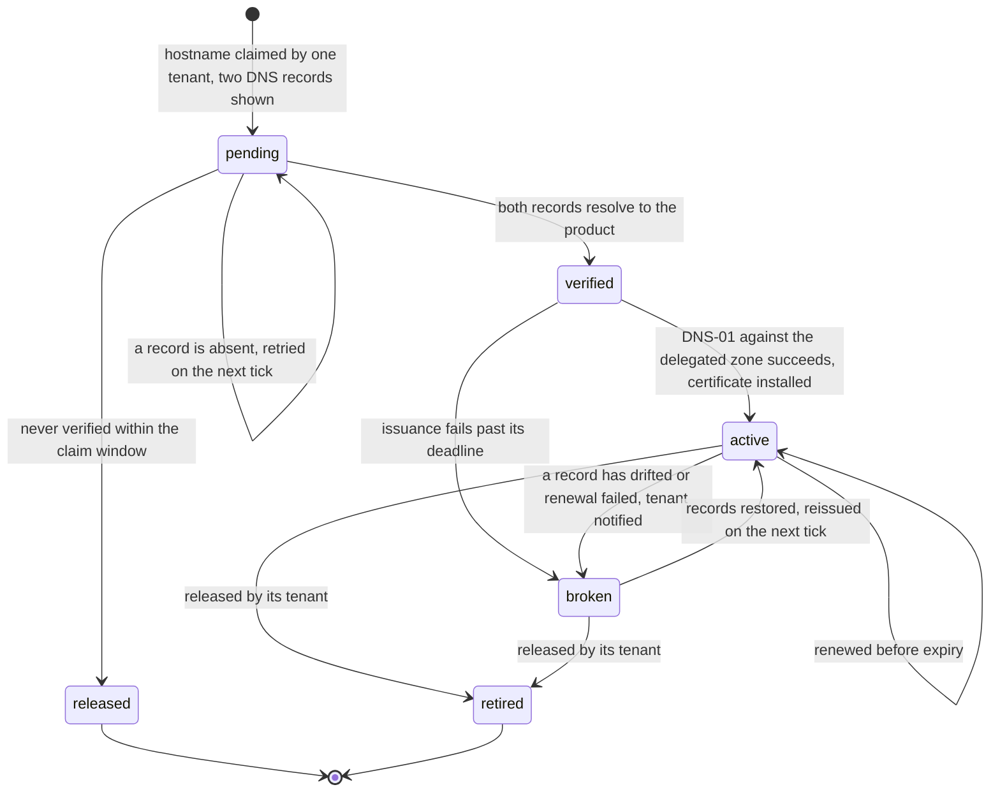

# Tenant hostnames: what a hostname decides, and what it never decides

## Why this exists

A product that gives each customer a hostname has made the hostname visible to
three things at once. The browser scopes cookies by it, the certificate
authority issues by it, and the application is tempted to authorize by it. The
first two are properties of the network. The third is a defect that arrives
looking like a convenience, because the `Host` header is written by the
client. This standard states what the hostname *is* for, so the real jobs are
done well and the wrong job is not done at all.

## The rules

### TH1. A tenant is an authentication boundary, and a role is an authorization boundary within one

**A tenant is the boundary a session is made into**. A person authenticates
into one tenant, on one host, and holds a session for that tenant and no
other. A person who belongs to two tenants authenticates twice. That is the
[authentication standard](060-auth.md)'s rule: one session, one tenant. It
holds for a product answering on one host as much as for one answering on a
thousand.

**A role is the boundary inside a tenant**. What a person can do, having
authenticated into a tenant, is a grant under [`070-rbac.md`](070-rbac.md)
RB5: a subject, a role, a scope within that tenant. The check operation
evaluates it on every request. The scope of that check comes from the
authenticated session (070 RB10). It does not come from a header, and **it
does not come from the hostname**.

The boundary is authentication and not authorization because of containment. A
tenant is not a scope a grant at some higher scope could satisfy; it is the
population a session was issued within. Modelling tenants as the top of the
scope hierarchy lets a `global` grant reach every tenant through one session.
That turns one compromised session into every customer's data. It is refused
by placing the tenant one layer out, where crossing it means authenticating
again.

### TH2. Before login the hostname chooses the tenant; after login it only agrees

A hostname does two jobs, one on each side of authentication, and neither is
authorization.

**Before login, the hostname decides which tenant's entry to show and which
tenant the new session binds to**. A visitor on a tenant host sees that
tenant's branding, its login, and its identity provider configuration where
the product supports one per tenant. When authentication completes, the
session is bound to that tenant. The host made the choice the default entry
would otherwise have to ask for. On the default entry, where no host has
chosen, the product asks, and the session is still bound to exactly one (TH3).

**After login, the hostname is checked for agreement with the session's
tenant, and that is all**. On every request the edge resolves the host to a
tenant, the application reads the tenant from the session, and the two are
compared. Agreement proceeds under the session's tenant; disagreement is
refused (TH3). **The tenant of a request is never derived from the `Host`
header**, because RB10 forbids it and because the agreement check makes the
derivation unnecessary. A request that proceeds has a host that agrees, and
the session's tenant is the one that was going to be used anyway.

The agreement check is defence in depth, precisely. Under TH4 a request on
host A cannot normally carry a session made on host B. The check exists for
where *normally* has failed: an edge misrouting by host, a host wrongly mapped
to two tenants. Each is a fault, which is why the refusal is audited (TH3)
rather than merely returned.

### TH3. A host that names no tenant is `404` at the edge, and the four invalid cases each have one answer

Four combinations of host and identity are invalid, and **each has exactly one
answer**. So no product invents a second and no reviewer has to ask.

| Case | The condition | The answer | Why that answer |
|---|---|---|---|
| **Unknown host** | The host names no tenant: not the default entry, not a subdomain in the tenant table, not an `active` custom domain (TH6) | `404`, at the edge, before any cookie is read or any application code runs | Nothing exists at this address. A `403` would say that something does and the caller is not permitted to have it, which leaks the existence of a tenant namespace and invites enumeration. And there is no identity to refuse, because the request was never let far enough to present one. |
| **Host and session disagree** | The host resolves to tenant A; the request carries a session bound to tenant B | `403`, and an audit event under [`080-audit.md`](080-audit.md) AE3's reserved `auth.access_denied`, carrying the host requested and the session's tenant | The session is valid, for its own tenant, so it is not ended; the *request* is wrong. And the condition is one TH4 makes nearly impossible, so its occurrence is a fault worth a record, not a `403` to be swallowed by a retry. |
| **Identity in several tenants** | The authenticated identity holds a user in more than one tenant, and arrived on a tenant host | Bound to the host's tenant at login; the other memberships are not consulted | The host chose. A session bound to a set of tenants is the shape one-session-one-tenant refuses; a person wanting the other tenant authenticates on the other host. |
| **Identity with no grant here** | The authenticated identity has no user in the host's tenant | [`060-auth.md`](060-auth.md) AU6 as written: `403`, and the session ends | This is AU6's unknown-subject case with a tenant's name on it, and it takes AU6's answer for AU6's reason: a `401` would send the person back to the provider to be signed straight in again, forever. |

**`404` at the edge is the rule that costs the most to get wrong**. Serving
the default entry for an unknown host means any name pointed at the edge shows
the product's login page under that name. That is a phishing kit the product
built itself.

### TH4. The session cookie is host-only, and `Domain=` is never set

**A session cookie on a tenant host is set without a `Domain=` attribute**,
which makes it host-only. The browser returns it to the exact host that set it
and to no other. The cookie for `acme.example.com` never reaches
`globex.example.com`, never reaches the default entry, and never reaches any
other host under the registrable domain. It therefore carries the `__Host-`
prefix, which is the browser's own enforcement of exactly this. The prefix is
rejected unless the cookie is `Secure`, has no `Domain=`, and is set from a
`/` path. The [authentication standard](060-auth.md) AU7 already names the
prefix for its default topology.

This is the rule that makes the host map of the [web estate
standard](091-web-estate.md) WE2 a boundary rather than a naming convention.
Without it, two tenants on one registrable domain share a cookie jar.
Isolation between them is then the agreement check of TH2 working every time
on every route, which no test proves. With it, a request on one tenant's host
arrives with no other tenant's session, and the agreement check is what its
name says: depth.

**A consequence, and a topology decision the product does not make
separately**: a host-only cookie is not sent to a different host. So the API a
tenant host's page calls is reached through the tenant host: path-based, AU7's
default topology, one origin per tenant host. The split topology AU7 admits,
with a cookie widened by `Domain=` to reach a sibling API host, is the
widening this rule forbids. The widened cookie reaches every tenant's host as
well. A product with tenant hostnames runs the default topology, per host, the
default entry included. The default entry's session does not follow a person
to a tenant host; they authenticate there, which is TH1 applied to a hop
across hosts.

### TH5. One callback host per topology, and the session lands on the tenant host without the browser holding a token

The identity provider holds a closed list of redirect URIs, and **that list
names one callback host per deployment topology, not one per tenant**. A
custom domain verified this afternoon must not require a provider change. A
per-tenant redirect URI puts onboarding on the provider's timetable, and a
wildcard is an open redirect the specification refuses. Both put the tenant
table in two places.

That creates the problem this rule answers: under TH4 the session cookie is
host-only to the tenant host, and the callback is not there. **The code
exchange completes at the callback host, in the relying party tier the
authentication standard's AU1 describes**. **The browser is returned to the
tenant host carrying an opaque, single-use handle**. The handle is a random
value the relying party minted, bound to the tenant host and to the flow's
state. It is redeemable once, within seconds, only by the tier that minted it.
The tenant host redeems it server-side, establishes the session and sets its
own host-only cookie.

Where one relying party tier serves every host, the redemption is a lookup in
its session store; where not, a server-to-server call. Either way the browser
held the handle for one hop and holds the cookie afterwards.

The handle is not a token. The distinction is the whole of the rule's
consistency with the [web client standard](090-web-client.md) WC1 and with 060
AU7. It grants nothing at any API, and it is verifiable by nobody but its
issuer. It is consumed on first use, so a copy from a history or a log redeems
nothing. And it lives for seconds, because it only has to survive one
redirect.

A token in the return URL would be a credential in the address bar. It would
be in the history, the referrer, every log line that records a URL. That is
the shape WC1 exists to refuse. The browser's part remains what WC1 states: it
is redirected, and it comes back holding a cookie.

Where a product offers one identity provider configuration per tenant, the
provider differs and the callback host does not. The configurations are tenant
data behind the relying party, and the browser never learns which was used.

### TH6. Subdomains are covered by a pre-issued wildcard, and a custom domain walks a state machine the product implements

Two kinds of tenant host, two certificate arrangements, and the product
declares which it offers (see *What a product declares* below).

**Tenant subdomains are covered by one wildcard certificate, pre-issued for
the product's own zone** by DNS-01 against that zone. The platform holds it as
[`085-security-baseline.md`](085-security-baseline.md) SB4 requires, and
renews it on its schedule. Nothing is issued when a tenant is created; the
name is covered before it exists. A certificate per subdomain would spend an
issuance on every sign-up and publish every tenant's name in transparency
logs, for no property the wildcard lacks.

**A custom domain, a customer's own hostname pointed at the product, walks a
state machine the product implements**, driven by a periodic job. The product
owns it because the tenant table is the product's and ownership of the
hostname is a fact about a customer.

The pieces, each with its reason:

- **One hostname belongs to one tenant, ever**. From the moment it is
  verified a hostname is that tenant's, and a released hostname is `retired`,
  never claimed again by another. A certificate or a cookie issued for that
  name in one tenant's era must never be honourable in another's. A bookmark
  or a cached redirect from the first tenant must never land a person in the
  second. Belonging begins at verification, not at the claim: a mistyped or
  abandoned claim would otherwise block a name for its real owner for ever.
  So a claim never verified is `released`, not retired; ownership was never
  proven and nothing was bound to the name.
- **Two DNS records are shown at onboarding**. The first is a `CNAME` from
  the hostname to the product's edge, and it routes traffic. The second is a
  `CNAME` from `_acme-challenge.<hostname>` to a label unique to that
  hostname under a validation zone the product controls. It delegates the
  DNS-01 challenge, so the product's job writes the challenge record in its
  own zone and the authority follows the delegation. The customer never
  hands over a DNS credential. Creating both records is the customer's proof
  of ownership, and the per-hostname label stops one tenant's delegation
  validating another's name.
- **A periodic job walks the machine**, declared under
  [`057-jobs.md`](057-jobs.md) JB3 as `periodic` · `single_flight` ·
  `short` · `idempotent`, with `stale_after` per JB8. Each tick it resolves
  the records of `pending` hostnames and runs DNS-01 for `verified` ones. It
  renews `active` ones approaching expiry, and re-resolves `active` ones to
  detect drift. It is idempotent because every step compares desired against
  observed state. It is single-flight because two ticks racing an issuance
  spend a rate limit twice.
- **Drift is detected, not discovered**. A hostname whose records have
  changed or whose renewal has failed moves to `broken`. The tenant's
  administrators are told through a notification under
  [`058-notifications.md`](058-notifications.md) NF5, naming the record that
  is wrong. The notification is transactional, because a customer whose own
  domain has stopped serving can hold the product to account for not saying
  so. The hostname stays in the table, and restoring the records restores it
  on the next tick.

### TH7. No certificate is ever requested for a host the tenant table does not hold

**The ACME client's allowlist is the tenant table**. A certificate is
requested for a hostname because the state machine of TH6 reached `verified`
for it, and for no other reason. An edge that issues a certificate on first
sight of a server name, whatever name arrives in the TLS handshake, is
refused. The exception is where the decision to issue is made by consulting
the tenant table first. In that case it is TH6's job wearing a different
trigger, and the table is still the allowlist.

Three reasons, each a property of the alternative. **Issuance is a shared,
rate-limited resource**. An edge that issues for any name lets anyone who can
point a hostname at it spend that limit. The tenant whose domain went
`verified` this afternoon then waits a week behind a stranger's names.

**A certificate is a statement that the product serves this name**. For a name
the product never claimed, it is a false statement with a signature on it,
logged in transparency. And it is for an address at which TH3 says nothing
exists. And **the table is where the answer already is**. A second list for
the certificate client is a second answer to *which hosts are ours*. The two
disagree the day one is edited by hand.

The rule binds whichever edge class issues: each one a product can declare is
driven from the table or issues on sight.

### TH8. A tenant host is `noindex`, on the header and in the document

**Every response from a tenant host carries `X-Robots-Tag: noindex`, and every
HTML document it serves carries the equivalent robots meta element**. A tenant
host is the product under another name: its login page, its application shell,
whatever it serves before authentication. There is no page on it a search
engine has any business listing.

Three reasons, and the third is the customer's. Indexed, every tenant host is
a duplicate of the default entry under another name. Indexed, the set of
tenant subdomains is the product's customer list, discoverable by a site
query. And indexed, a customer's own domain carries search results for a login
page they did not write, beside results for their own marketing site. Under
the [web estate standard](091-web-estate.md) WE2 a customer's marketing is the
customer's, and a tenant host stays out of it.

Both the header and the element, because they reach different readers. The
header covers every response, including the ones that are not HTML. The
element survives a copy of the page that has lost its headers. A `robots.txt`
that disallows crawling is not a substitute for either. A URL a crawler is not
permitted to fetch can still be indexed from links to it. And a crawler that
is not permitted to fetch never sees the `noindex` that would have told it not
to.

## What a product declares

Four things this document leaves open on purpose, each stated in the product's
**Conventions**:

| Declaration | The choices | Why it is the product's |
|---|---|---|
| **Which tenant hosts it offers** | subdomains only; custom domains only; both | A product sold to individuals has no use for custom domains, and one sold as white-label has no use for anything else. TH6 applies to whichever is offered. |
| **Which edge class issues certificates** | the product's own edge with an ACME client; the platform's certificate manager; a delivery network's custom hostname facility | Each satisfies SB4 and each can be driven from the tenant table (TH7). Which one is a property of where the product is deployed. |
| **Whether a customer's apex is supported** | yes, with the stable address or record type the product's edge offers; no, subdomains of the customer's domain only | An apex cannot carry a `CNAME`, and supporting one is an edge capability the product either has or does not. |
| **How deep the branding goes** | the login page; the application shell; the notification templates under 058 NF8; the identity provider configuration per tenant | Each layer is a feature with a cost, and TH2 holds at every depth: the host chooses what is shown, and nothing the host chooses is an authorization input. |

A product with one host and tenants chosen at login is still bound by TH1 and
TH4, which hold for a single host. It has nothing for the rest to apply to.
Its Conventions say so in a line.
